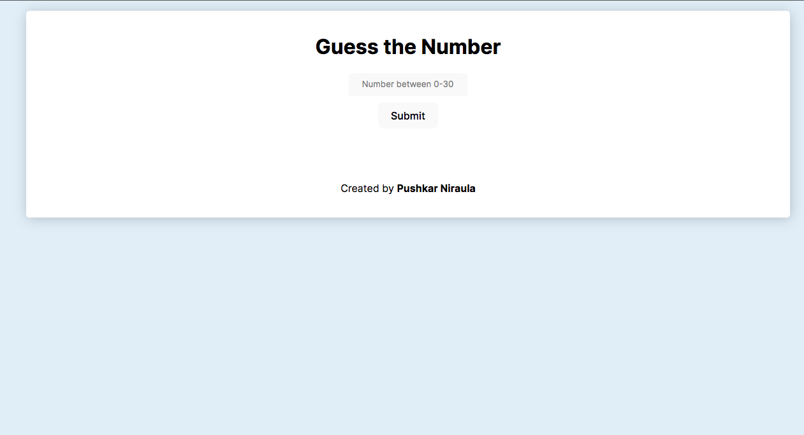
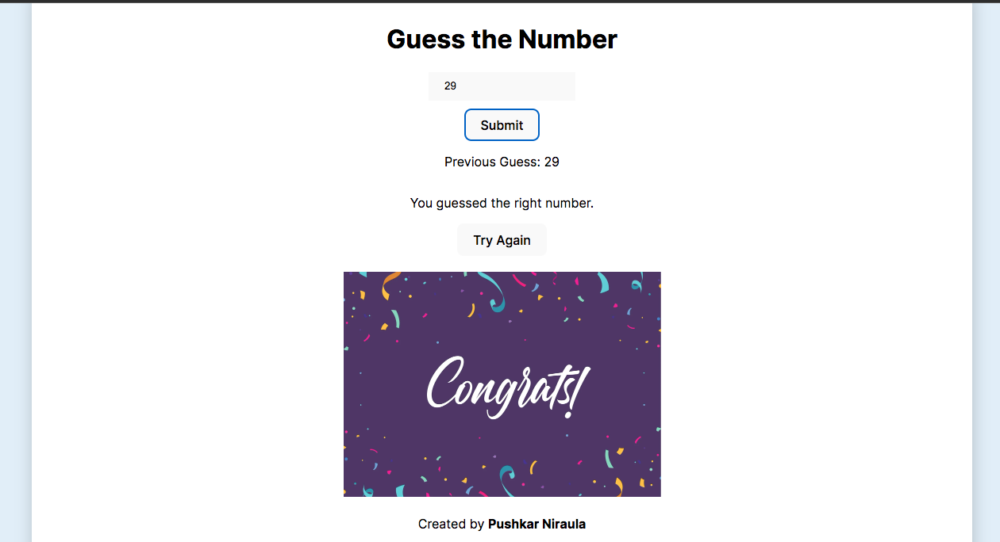

# Guess the Number Game

This is a simple "Guess the Number" game built using HTML, CSS, and JavaScript. The goal of the game is to guess a randomly generated number between 0 and 30, with up to 10 chances.

## Features

- The user enters a number between 0 and 30.
- The app gives feedback on whether the guess is correct or incorrect.
- The user has up to 10 guesses to win the game.
- If the user guesses the correct number, a congratulatory message and image appear.
- If the user fails to guess within the allowed attempts, a "You lost the game" message appears.
- A "Try Again" button allows the user to reset the game and start over.

## Technologies Used

- **HTML**: For the structure of the game.
- **CSS**: For styling the game and making it responsive for mobile devices.
- **JavaScript**: For game logic and interaction with the user.

## Setup

To run this project locally, follow these steps:

1. Clone the repository:

   ```bash
   git clone https://github.com/puskar26/JS_mini_Projects.git
   ```

2. Navigate to the project directory:

   ```bash
   cd Project_4
   ```

3. Open the `index.html` file in your browser to play the game.

## Game Rules

- Enter a number between 0 and 30 in the input field.
- Click the **Submit** button to submit your guess.
- The game will display the previous guess and let you know if you guessed correctly or incorrectly.
- You have up to 10 attempts to guess the correct number.
- If you guess the correct number, you'll see a congratulatory message and image.
- If you lose, a message will notify you that you've lost the game.
- The **Try Again** button lets you reset the game and try again.

## Project Structure

```bash
Project_4/
│
├── index.html
├── style.css
├── script.js
├── 1600w-RXDhbgx0JLs.webp
├── code.md
├── interface.png
├── winner.png
└── README.md
```

## Screenshots

### Game Interface



### Winning Message



## Future Enhancements

Some possible improvements to this game include:

- Add sound effects when the player guesses the correct or wrong number.
- Track the number of wins and losses across multiple games.
- Allow the player to choose the range of numbers for more difficulty levels.

## License

This project is licensed under the MIT License. See the [LICENSE](LICENSE) file for more information.

## Author

Created by [Pushkar Niraula](https://www.pushkarniraula.com.np).
